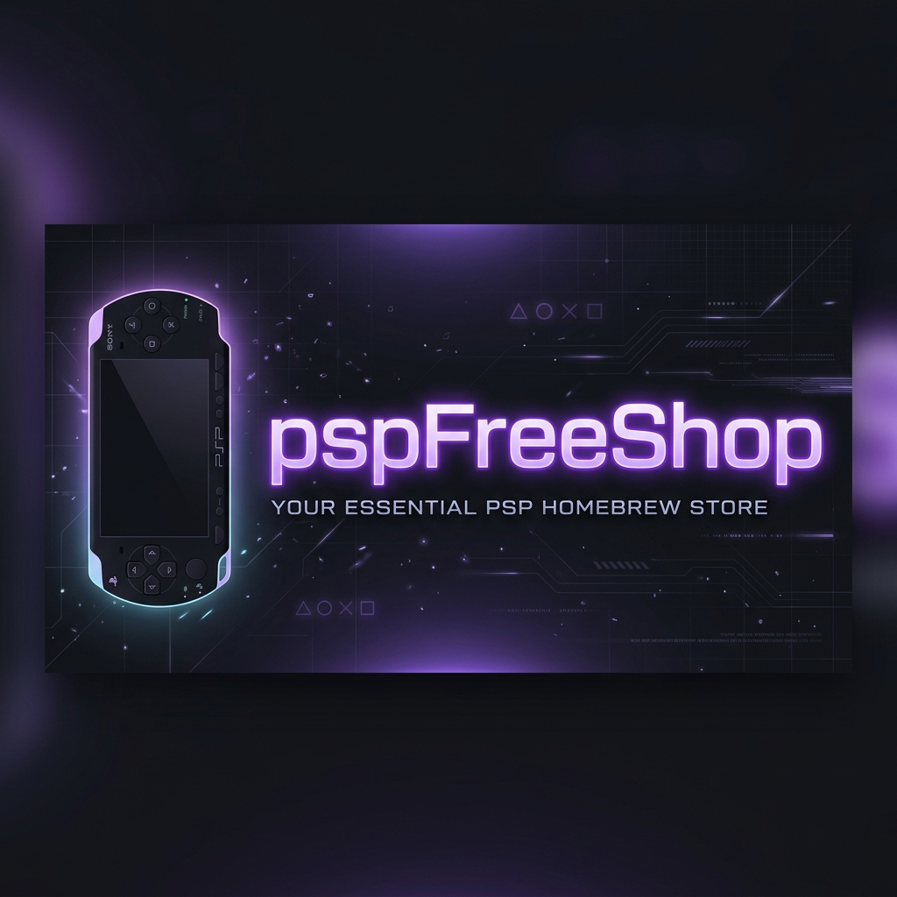

# 🎮 pspFreeShop Enhanced
### Uma experiência premium de gerenciamento e download para o seu Sony PSP.

---

## 🌟 Sobre o Projeto
O **pspFreeShop Enhanced** é um gerenciador de conteúdo completo para o Sony PSP, desenvolvido em Python com uma interface moderna e intuitiva. Ele permite navegar por uma vasta biblioteca de jogos, atualizações e DLCs diretamente do seu PC e instalá-los no console com apenas um clique.

Baseado nos bancos de dados NoPayStation, ele automatiza todo o processo de download, extração (PKG para ISO/EBOOT) e transferência.

---

## 🚀 Funcionalidades Principais

| Recurso | Descrição | Status |
| :--- | :--- | :---: |
| 🎮 **Loja Integrada** | Navegue por milhares de jogos de todas as regiões (EUA, EUR, JAP). | ✅ |
| 💾 **Gerenciamento** | Visualize e gerencie os jogos já instalados no seu memory stick. | ✅ |
| 🔄 **Atualizações** | Verificação de updates disponíveis para seus jogos. | ✅ |
| 📦 **DLCs** | Baixe conteúdos DLCs para expandir sua biblioteca. | ✅ |
| ⚡ **Extração Automática** | Integração com `pkg2zip` para extrair arquivos PKG instantaneamente. | ✅ |
| 🌍 **Multi-idioma** | Interface disponível em Português (BR) e Inglês. | ✅ |
| 🎨 **Temas** | Interface disponível em Português (BR) e Inglês. | ✅ |
| 🔒 **Segurança** | Downloads seguros direto dos servidores da Sony. | ✅ |

---

  <!-- Exemplo de como adicionar prints -->
  <!--  -->
  <!--  -->
  
<i>Design Dark Premium com cores inspiradas no PlayStation.</i>

---

## 📦 Guia do Usuário (Instalação e Uso)

Siga os passos abaixo para começar a usar o **pspFreeShop** no seu Windows:

### 1. Download
Baixe a versão mais recente na seção de [Releases](https://github.com/marcosferreirarj/pspFreeShop/releases) ou o arquivo executável enviado pelo desenvolvedor.

### 2. Preparação do PSP
1. Conecte seu PSP ao PC via cabo USB ou faça direto no SD card.
2. Ative a **Conexão USB** no menu do console.

### 3. Utilizando o App
1. Abra o `PSPFreeshop.exe`.
2. Ao iniciar, escolha o seu idioma preferido (**Português** ou **Inglês**).
3. Selecione o **Drive do seu PSP** (ex: Letra `E:`, `F:`, etc) quando solicitado.
4. **Navegue e Baixe**:
   - Vá na aba **Loja** para procurar novos jogos.
   - Use o botão **Download** e o app fará tudo: BAIXAR ➔ EXTRAIR ➔ COPIAR.
   - O jogo aparecerá automaticamente no seu PSP na pasta `ISO/` ou `PSP/GAME/`.

---

## 🛠️ Requisitos do Sistema
* **Sistema Operacional**: Windows 7/10/11 (64-bit recomendado).
* **Conexão**: Internet para download dos jogos.
* **Espaço**: Depende do tamanho dos jogos que você deseja baixar.
* **Dependência**: O arquivo `pkg2zip.exe` deve estar na mesma pasta do executável (já incluído no pacote).

---

## 🤝 Créditos e Tecnologias
* **CustomTkinter**: Pela interface moderna e customizável.
* **pkg2zip**: Pela ferramenta essencial de extração de pacotes.
* **NoPayStation**: Pelos bancos de dados de conteúdo.
* **PSPFreeshop**: Pelo projeto original.

---

  
Desenvolvido com ❤️ para a comunidade PSP.

  
Este projeto não incentiva a pirataria. Utilize apenas com backups de jogos que você possui legalmente.

